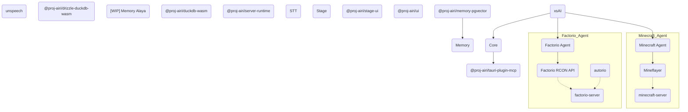

# Monorepo 与微服务架构：AIRI 项目的架构选择分析

在现代软件架构设计中，Monorepo 和微服务是两个经常被讨论的概念。虽然它们解决的是不同层面的问题，但在实际项目中往往需要做出选择或平衡。本文将通过分析 AIRI 项目，探讨这两种架构的特点、区别以及适用场景。

## Monorepo 与微服务的本质区别

首先，我们需要明确一点：Monorepo 和微服务解决的是不同维度的问题。

**Monorepo** 是一种代码管理策略，关注的是如何组织和管理代码：
- 将多个相关的项目或模块存储在同一个代码仓库中
- 便于代码共享、依赖管理和协同开发
- 强调的是代码的物理存储方式

**微服务** 是一种系统架构模式，关注的是如何拆分和部署服务：
- 将一个大型应用拆分成多个独立的小服务
- 每个服务可以独立开发、部署和扩展
- 强调的是系统的运行时架构

## AIRI 项目的架构分析

通过分析 AIRI 项目的结构和文档，我们可以看到它采用了 Monorepo 架构，但并不完全等同于微服务架构。

### AIRI 的 Monorepo 结构

AIRI 项目将所有相关组件组织在同一个仓库中：

```
airi/
├── apps/                 # 应用程序
├── crates/               # Rust 包
├── packages/             # 核心功能包
├── plugins/              # 插件
├── services/             # 服务
├── docs/                 # 文档
└── ...
```

这种结构体现了 Monorepo 的核心优势：
1. **代码共享**：UI 组件、工具函数等可以在多个应用间共享
2. **统一依赖管理**：所有模块使用统一的依赖配置
3. **协同开发**：团队成员可以更容易地了解整个项目的结构

### AIRI 的服务化倾向

虽然 AIRI 采用了 Monorepo 结构，但从其架构图中可以看出，它具有明显的服务化倾向：



从架构图可以看出，AIRI 项目具有以下特点：
1. **核心服务**：Core 作为中央协调器
2. **独立代理**：Factorio Agent 和 Minecraft Agent 作为独立的服务组件
3. **外部集成**：通过适配器与外部系统（如 Discord、Telegram）集成

这种架构可以称为"服务化 Monorepo"，它结合了 Monorepo 的代码管理优势和微服务的架构灵活性。

## Monorepo 与微服务的对比

### Monorepo 的优势

1. **开发效率**：
   - 跨模块重构更容易
   - 代码共享和复用更方便
   - 统一的构建和测试流程

2. **一致性**：
   - 统一的编码规范和工具链
   - 一致的依赖版本管理
   - 统一的发布流程

3. **协同开发**：
   - 团队成员更容易了解整体架构
   - 减少跨团队沟通成本
   - 原子性提交确保变更一致性

### 微服务的优势

1. **独立部署**：
   - 每个服务可以独立部署和扩展
   - 故障隔离，单个服务故障不影响整体系统
   - 技术栈可以多样化

2. **团队自治**：
   - 不同团队可以独立开发和维护各自的服务
   - 减少团队间的依赖和协调成本
   - 适合大型分布式团队

3. **可扩展性**：
   - 可以根据需求独立扩展特定服务
   - 更好地利用资源

## 适用场景分析

### 适合 Monorepo 的场景

1. **紧密耦合的系统**：模块间依赖关系复杂，需要频繁协同开发
2. **小型到中型团队**：团队规模适中，沟通成本较低
3. **共享代码较多**：需要大量共享组件和工具函数
4. **统一技术栈**：整个项目使用相似的技术栈

AIRI 项目正是这类场景的典型代表：
- 各个模块（UI、核心逻辑、游戏代理等）紧密相关
- 需要共享大量组件（如 UI 组件、工具函数等）
- 团队规模适中，便于统一管理

### 适合微服务的场景

1. **大型分布式系统**：系统规模庞大，需要拆分管理
2. **独立业务领域**：各服务负责不同的业务领域
3. **大型团队**：多个团队独立开发不同服务
4. **多样化技术栈**：不同服务可能使用不同技术栈

### 混合架构的适用场景

在实际项目中，很多系统会采用混合架构，如 AIRI 项目：
- 使用 Monorepo 管理代码，获得开发效率和一致性优势
- 在运行时采用服务化架构，获得独立部署和扩展能力

这种架构结合了两种模式的优点，适用于：
- 需要频繁协同开发但又希望保持一定独立性的项目
- 团队希望统一管理代码但又需要灵活部署的场景
- 正在从单体应用向微服务演进的项目

## 结论

Monorepo 和微服务并不是非此即彼的选择，它们解决的是不同层面的问题。AIRI 项目很好地展示了如何结合两者的优势：

1. **使用 Monorepo 管理代码**：通过统一的代码仓库提高开发效率和代码质量
2. **采用服务化架构**：在运行时将系统拆分为独立的服务组件，提高系统的灵活性和可扩展性

对于类似 AIRI 这样的项目，这种混合架构是理想的选择：
- 保持了 Monorepo 在开发阶段的优势
- 获得了微服务在运行时的灵活性
- 适应了项目当前的发展阶段和团队规模

最终，架构选择应该基于项目的具体需求、团队规模、技术栈和发展阶段来决定，而不是盲目追随某种潮流。AIRI 项目的架构选择体现了对这些因素的综合考虑，为其他类似项目提供了有价值的参考。
